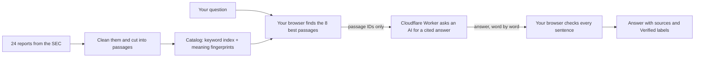

# FilingLens, explained from scratch

This document explains how FilingLens works and why it was built the way it was, in plain words. You don't need to know anything about AI or computers to read it. By the end, you should be able to explain the project to someone else, such as a recruiter, and answer their questions.

It was written by Claude, the AI coding assistant that built FilingLens with the project owner. Claude wrote it from the code, the project documents, and the history of every build session.

**How to read it**

- **Short on time?** Read [The one-minute version](#1-the-one-minute-version), then [How to explain FilingLens to a recruiter](#19-how-to-explain-filinglens-to-a-recruiter).
- Most sections say **what happens** first and then **why** it was done that way. The "why" is the important part.
- Each technical word is explained the first time it appears, and all of them are collected in the [Glossary](#20-glossary) at the end.
- Blocks that start with **"Think of it like this"** give an everyday comparison.

## Contents

1. [The one-minute version](#1-the-one-minute-version)
2. [The problem FilingLens solves](#2-the-problem-filinglens-solves)
3. [The rules the project set for itself](#3-the-rules-the-project-set-for-itself)
4. [The big picture: a library with a very careful librarian](#4-the-big-picture-a-library-with-a-very-careful-librarian)
5. [Step 1: Collecting the reports](#5-step-1-collecting-the-reports)
6. [Step 2: Reading and cleaning the reports](#6-step-2-reading-and-cleaning-the-reports)
7. [Step 3: Cutting the reports into passages](#7-step-3-cutting-the-reports-into-passages)
8. [Step 4: Building the search catalog](#8-step-4-building-the-search-catalog)
9. [Step 5: Finding the right passages, inside your browser](#9-step-5-finding-the-right-passages-inside-your-browser)
10. [Step 6: Writing the answer (the gateway)](#10-step-6-writing-the-answer-the-gateway)
11. [Step 7: Checking the answer](#11-step-7-checking-the-answer)
12. [Measuring quality: the report card](#12-measuring-quality-the-report-card)
13. [The website](#13-the-website)
14. [Keeping secrets secret and staying safe](#14-keeping-secrets-secret-and-staying-safe)
15. [Robot helpers: tests, CI, and the daily check](#15-robot-helpers-tests-ci-and-the-daily-check)
16. [How the project was built](#16-how-the-project-was-built)
17. [What didn't work, and what was learned](#17-what-didnt-work-and-what-was-learned)
18. [Honest limits](#18-honest-limits)
19. [How to explain FilingLens to a recruiter](#19-how-to-explain-filinglens-to-a-recruiter)
20. [Glossary](#20-glossary)

---

## 1. The one-minute version

FilingLens is a website where you can ask questions about the yearly reports of 12 big American companies, for example: "What was Alphabet's total revenue in fiscal year 2025?"

An AI writes the answer, but with three twists that most AI chatbots don't have:

1. **It shows where every fact came from.** Each sentence ends with small numbered tags, like footnotes. Click one and you see the exact passage from the company's report, with the matching sentence highlighted.
2. **It checks itself.** Once the answer is written, the website checks every sentence: does it point to a source, and does every number in it really appear in that source? Sentences that pass are labelled **Verified**. The rest are labelled **Unverified**, so you know to double-check them.
3. **It admits when it doesn't know.** If the reports don't contain the answer, it says so instead of making something up. If the question contains a wrong assumption ("Why did Apple's sales fall?" when they actually rose), it corrects it.

The project also measured how good it is, using a 211-question exam, and publishes the scores. It costs $0 to run.

- Live site: <https://filinglens.azar-majed7.workers.dev> (no login)
- 81-second demo video: <https://youtu.be/P4qqevx9zMk>

---

## 2. The problem FilingLens solves

### What is a 10-K?

In the United States, every company whose shares are sold on the stock market has to publish a big report once a year, called a **10-K**. It goes to the **SEC** (the Securities and Exchange Commission), the government office that makes sure companies tell investors the truth. The SEC publishes all of them for free on its website, **EDGAR**.

> **Think of it like this:** a 10-K is a company's yearly school report and diary in one. It says what the company does, what could go wrong, how much money it made and spent, and why.

10-Ks are long. The five sections FilingLens keeps from JPMorgan Chase's report alone add up to about 1.1 million characters, more than twice the length of the first Harry Potter book. Finding one number in there by hand takes time.

### Why not just ask a chatbot?

AI chatbots run on **large language models (LLMs)**: programs that learned to write by reading enormous amounts of text. They write very well, but they sometimes **hallucinate**: they state something confidently that is simply wrong, like a student who didn't do the reading and bluffs. For questions about money, a made-up number is worse than no answer.

### The FilingLens idea

Don't let the AI answer from memory. Instead:

1. **Find** the right pages in the real reports first.
2. **Hand only those pages** to the AI and tell it to write only from them, with a footnote on every sentence.
3. **Check** every footnote and every number afterwards.
4. If the pages don't contain the answer, **say so**.

Engineers call steps 1 and 2 **RAG**, short for *retrieval-augmented generation*: "retrieval" means finding, and "generation" means writing.

> **Think of it like this:** an open-book exam where the student must put a footnote on every sentence, and a teacher then checks every footnote against the book.

---

## 3. The rules the project set for itself

Before any code was written, the project owner wrote a brief with a few rules that could never be broken. Almost every later decision follows from them.

1. **It must cost $0, everywhere.** Building, testing, hosting, and running the AI all use free plans, and only free plans that don't even ask for a credit card.
   - *Why:* a portfolio project has to stay online for months without bills, nobody can be surprised by a charge, and it shows you can build something real with free tools. You'll see "because of the $0 rule" many times below.
2. **Recruiter-first.** A recruiter clicks one link and it just works: no login, no setup, it works on a phone, and the first click shows an answer instantly. When free limits run out, the site shows a friendly message instead of an error.
3. **Every number is measured.** Any score on the website or in the README comes from a test run that anyone can repeat.
4. **The exam tests the real thing.** The quality tests run the exact same code the website runs, never a copy.
   - *Why:* grading a copy tells you nothing about the original, like testing the spare key instead of the one you actually use.
5. **Public, but no secrets.** The code is public on GitHub. Passwords and keys never are, and neither is personal information.

The brief also split the work into eight **milestones** (M0 to M7), each with a checklist that had to be fully ticked before moving on. That story is in [section 16](#16-how-the-project-was-built).

---

## 4. The big picture: a library with a very careful librarian

> **Think of it like this:** FilingLens is a library.
>
> - **Before opening day**, the library collects 24 reports, cleans them up, cuts them into about 10,500 passages, and makes two kinds of catalog cards for every passage.
> - **When you ask a question**, a librarian working *inside your own browser* finds the 8 most useful passages.
> - **A writer** (an AI, reached through a small server) writes a short answer using only those 8 passages, with a footnote on every sentence.
> - **A fact-checker**, back in your browser, checks every footnote and every number.
> - **A report card** (a 211-question exam) measures how well the librarian, the writer, and the fact-checker do their jobs.

### Where each part lives

| Part | Where it runs | Written in | Folder |
| --- | --- | --- | --- |
| Download, clean, and cut the reports | Once, on a laptop (or on GitHub's computers) | Python | `pipeline/` |
| Build the search catalog | Once, same place | TypeScript | `scripts/` |
| Find passages, check answers | The visitor's browser | TypeScript | `packages/core/`, `web/` |
| Write the answer | A small Cloudflare server | TypeScript | `worker/` |
| The exams | A laptop, or GitHub's computers | TypeScript | `evals/` |

**Why two languages?** The download-and-clean step runs only once, offline, and Python has excellent tools for reading messy web pages. Everything else had to run in three places: the browser, the Cloudflare server, and the exam runner. **TypeScript** (JavaScript with extra checks that catch mistakes before the code runs) is the one language that runs in all three.

**One shared brain.** The folder `packages/core` holds the searching, prompt-building, footnote-reading, and checking code. The browser, the server, and the exams all use this same folder.

- *Why:* with three copies, they would slowly drift apart, and the exam would end up grading a copy nobody uses (rule 4).

---

## 5. Step 1: Collecting the reports

### Which companies?

| Company | What it does |
| --- | --- |
| NVIDIA, AMD, Intel | Computer chips |
| Apple, Microsoft, Alphabet (Google), Amazon, Meta (Facebook, Instagram) | Big tech |
| Netflix | Streaming |
| Coca-Cola, PepsiCo | Drinks and snacks |
| JPMorgan Chase | Banking |

The list came from the original brief and can be changed in one file, `pipeline/config/corpus.yaml`. It works well because:

- anyone recognizes these names;
- the industries differ, so the reports look different (a bank's report is laid out very differently from a chip maker's), which tests the code that reads them;
- it has natural rivals (AMD and Intel, Coca-Cola and PepsiCo), which makes comparison questions natural.

### Two years each, so 24 reports

The two most recent 10-Ks per company. Corrected versions (called 10-K/A) are skipped.

- *Why two years:* questions like "How did NVIDIA's research spending change?" become possible, and the download stays small.

### Only five sections of each report

| Section | In plain words |
| --- | --- |
| Item 1: Business | What the company does |
| Item 1A: Risk Factors | What could go wrong |
| Item 7: Management's Discussion and Analysis | The managers explain the year's numbers in words |
| Item 7A: Market Risk | How things like interest rates or exchange rates could hurt the company |
| Item 8: Financial Statements | The big tables of money: revenue, profit, cash, and so on |

- *Why:* every visitor's browser has to download the search catalog (see [Step 5](#9-step-5-finding-the-right-passages-inside-your-browser)), so the catalog had a size budget of 12 MB. These five sections hold what most people ask about.
- *What was given up:* questions about anything else are declined. For example, a CEO's salary isn't in these sections (companies usually publish it in a separate document called a proxy statement), so FilingLens says it can't answer.

### Being polite to the SEC

The SEC has a fair-access policy for automated downloads, and the downloader follows it:

- **Say who you are.** Every request carries a name and contact email, as the SEC requires. That email is kept out of the public code: it lives only in a setting on the owner's laptop and in a GitHub secret.
- **Don't rush.** At most 5 requests per second (the SEC allows 10), and if the SEC says "slow down", wait and try again.
- **Download each file only once.** Everything is saved locally (a **cache**), plus a list of every file with its **sha256 fingerprint** (a short code that changes completely if even one letter of the file changes).
- *Why:* it's the SEC's rule, and people who break it get blocked.

### Other small decisions

- **Company ID numbers are looked up, never typed.** The SEC identifies companies by a number called a CIK. The code looks them up in the SEC's official list every time instead of writing them down from memory.
  - *Why:* one wrong digit means the wrong company, and an AI assistant might misremember one.
- **The year comes from the report itself.** Companies have a **fiscal year**, their own accounting year, which often isn't January to December (Apple's ends in September, Microsoft's in June). The code reads the year printed inside each report. That's also why "the latest year" is different for each company: Microsoft's and NVIDIA's newest reports are already for fiscal 2026.

**Result:** all 24 reports downloaded with no failures.

---

## 6. Step 2: Reading and cleaning the reports

10-Ks are web pages (**HTML**) full of things that get in the way:

- **Hidden computer labels.** Every number in a modern 10-K carries invisible machine-readable tags (called inline **XBRL**). They are removed from the text. (The same tags are useful later, for the exam, in [section 12](#12-measuring-quality-the-report-card).)
- **Page leftovers.** Page numbers, repeated headers and footers ("Our Strategy 4"), and navigation links are removed.
- **The table of contents.** "Item 7" appears once in the table of contents before the real Item 7. The reader picks the occurrence that starts the longest section, which is always the real one.
- **Tables.** Tables are turned into simple text tables (a format called **Markdown**), and the line that gives the units ("in millions, except per share data") is carried along with them. Cells that split a "$" or a ")" away from its number are glued back together.
  - *Why the units matter:* "416,161" means nothing until you know it's millions of dollars.

### Surprises from real reports

The first version assumed every report has headings like "Item 7". Real reports disagreed:

- **Intel** has no "Item" headings at all. Its report is organized by topic, and headings are shown only as large white letters on a blue band, never in bold. The reader learned to spot headings by their bigger type, and Intel got a small map of where each section starts and ends.
- **JPMorgan Chase's** Items 7, 7A, and 8 just say "see the Annual Report section" further down the file.
- **NVIDIA, Netflix, and PepsiCo** print their financial statements outside Item 8.

The fix was the same each time: `corpus.yaml` can give a company its own "this section starts at heading X and ends at heading Y" patterns.

**Result:** all five sections were found in all 24 reports (the goal was 95%).

### Everything points to character positions

Each cleaned report is saved as one plain text file. Everything later (passages, footnotes, the exam's answer key) points into it by **character position**, for example "characters 106,810 to 106,950 of Apple's 2025 report".

> **Think of it like this:** saying "page 12, line 4" instead of "the third index card in the box". If you later cut the book into different cards, "page 12, line 4" still points to the same words.

- *Why:* the way the text is cut into passages can change at any time (and FilingLens compares two ways), but the exam's answer key keeps pointing to the right words.

The reader is tested on small hand-made example pages, never on full reports, so the tests are fast and need no internet.

---

## 7. Step 3: Cutting the reports into passages

### Why cut at all?

Search tools and AIs work on bite-sized pieces. You can't hand an AI 24 whole reports, and a footnote should point to a paragraph, not to a 300-page document. These pieces are called **chunks** or **passages**.

### Tokens

AI models read text in small pieces called **tokens**: a word or part of a word (a long word like "unbelievable" might be three tokens). Passage sizes are measured in tokens, using the exact same **tokenizer** (the word-splitter) as the search model, pinned to one exact version. A test checks that the Python side and the website side use the very same one.

- *Why:* if sizes were counted differently, passages could quietly become too long for the model.

### Two ways to cut, built so they could be compared

| | Cookie cutter ("fixed") | Cut along the lines ("structure") |
| --- | --- | --- |
| How | Every 350 tokens, with a 50-token overlap so a sentence cut in half appears whole in one of the pieces | Cut at headings; pack paragraphs under the same heading up to 350 tokens; keep tables whole up to 600 tokens; split bigger tables by rows and repeat the header row in each piece |
| Ignores headings and tables? | Yes | No |
| Label line on top? | No | Yes: "Apple FY2025 10-K \| Item 7 … \| heading" |
| Number of passages | 6,817 | 10,547 (typical size: 211 tokens) |

- *Why the label line:* a passage that says "revenue grew 10%" is useless if you don't know whose revenue, or which year. The label helps both kinds of search find it and tells the AI where the passage came from.
- *Why repeat a table's header row:* a row of numbers means nothing without the header that says which column is which year.
- *The 600-token decision:* the search model reads only the first 512 tokens of a passage. Claude pointed out that the last rows of the biggest tables would then be invisible to meaning search, though still findable by keyword search. The owner kept 600, as the brief said. This affects 287 passages (2.7%).

**Result:** cutting along the structure won by a mile. On the practice questions, the cookie-cutter version found the right evidence in its top 10 only 64.9% of the time, against 88.7%. The structure version is the one the website uses.

---

## 8. Step 4: Building the search catalog

FilingLens makes two different catalogs, because there are two good ways to find a passage.

### Catalog 1: the keyword index (BM25)

> **Think of it like this:** the index at the back of a textbook. For every word, it lists the passages that contain it and how many times.

When you search, a passage scores higher when it contains your words, and especially your *rare* words: "buyback" tells you more than "company". Extra repeats of a word count less and less, and long passages don't win just by being long. The standard recipe for this scoring is called **BM25**, and search engines have used it since the 1990s.

A few details: capital letters are ignored, tiny common words ("the", "and") are skipped, plurals are trimmed ("expenses" becomes "expense"), and "60,922" is treated the same as "60922" so numbers match with or without commas.

**Decision: a small home-made BM25 instead of a ready-made library (MiniSearch).**

- *Why:* it's about 130 lines, the files it produces are small and exactly the same every time, it adds no dependency, and the same word-splitting code runs both when the catalog is built and when you search. If the two ever split words differently, your words wouldn't match the catalog's.

### Catalog 2: meaning fingerprints (embeddings)

A small AI model reads each passage and turns it into a list of 384 numbers, called an **embedding**.

> **Think of it like this:** those 384 numbers are coordinates on a giant map of meaning. Passages about similar things sit close together, even if they use different words. "Money spent on research" and "research and development expense" land near each other.

Your question gets coordinates too, and the search looks for the passages closest to it. This is called **dense search** or **meaning search**.

**The model: `bge-small-en-v1.5`**, made by BAAI (the Beijing Academy of Artificial Intelligence), free under the MIT license, in a version converted to run inside web browsers.

- *Why this one:* small enough to download into a browser, made for English, designed for search, and a browser-ready version exists.
- Its instructions say to put the phrase "Represent this sentence for searching relevant passages:" in front of questions (but not passages), so FilingLens does.

### Making it small enough for a browser

- **A compressed model.** The model is stored in a compressed form called **q8** (numbers kept with less precision, which is called **quantization**): 34 MB instead of 133 MB. The same file is used when building the catalog and in your browser, so the fingerprints match.
- **Compressed fingerprints.** Each fingerprint number is rounded to a small whole number between -127 and 127, plus one scale number per passage. All 10,547 fingerprints fit in about 4 MB.

  > **Think of it like this:** measuring to the nearest millimetre instead of the nearest micrometre. You lose almost nothing and save a lot of space.

- **Passage text in 256 small files.** The text is spread over 256 small files (called **shards**), and a passage's name decides which file it goes in. Your browser downloads only the few files that hold the passages it shows, and the server reads only what it needs.
  - *Why:* the free server plan allows only 10 milliseconds of computing per request, so it can't open big files.

### Other catalog decisions

- **Budget:** at most 12 MB compressed per catalog. Actual: 7.84 MB for the structure catalog and 7.09 MB for the cookie-cutter one. Every file is under 25 MiB, Cloudflare's per-file limit.
- **Pinned model versions.** Models live on **Hugging Face**, the big public website for AI models, and their authors can update them. FilingLens pins one exact version (a "revision").
  - *Why:* so the model can never change underneath the project without anyone noticing.
- **Same input, same output.** Rebuilding the catalog produces byte-for-byte identical files.
  - *Why:* if a file changes, you know something really changed.
- **Saved work.** Fingerprinting every passage takes about 20 minutes on a laptop, so results are saved and reused on the next build.

---

## 9. Step 5: Finding the right passages, inside your browser

### The big decision: search runs in the visitor's browser

Most search systems run on a server with a special **vector database**. FilingLens does it inside your own web browser instead.

- *Why:* the $0 rule. A search server costs money or needs a credit card, while your browser is free and every visitor brings their own computer. As a bonus, searches are fast once everything is loaded, and there's nothing to overload when many people visit.
- *What was given up:* the first visit downloads the model (34 MB) and the catalog (about 8 MB). Depending on the connection, that takes from about 10 seconds to 3 minutes, and the browser then keeps them for next time.
- *How that cost is hidden:* the page appears immediately and never waits for the download, a progress bar shows how it's going, and the six example questions work without any download at all.

### The background helper

The model runs in a **Web Worker**, a helper that works in the background, so the page never freezes. It uses your graphics chip (**WebGPU**) if the browser offers one, and otherwise **WebAssembly** (**WASM**), a way of running fast code in any browser.

### The four steps of a search

Take the example question *"What was Alphabet's total revenue for fiscal year 2025?"*

**1. Filters: which reports?** The question is scanned for company names, stock tickers, and nicknames ("Google" means Alphabet, "Facebook" means Meta, "Coke" means Coca-Cola, "Chase" means JPMorgan), and for years ("FY2025", "fiscal 2024", "2025"). "Last year" or "latest" means each company's most recent report. Only the matching reports are searched: here, just Alphabet's 2025 report, 1 of the 24.

- *Why:* without filters, a question about Apple could pull in a Microsoft passage that uses the same words.
- *Measured:* without filters, the right evidence reached the top 10 17 points less often, and 24 points less often for questions comparing two companies.

**2. Two searches.** Keyword search and meaning search each pick their top 50 passages from the allowed reports. They simply compare the question with every passage. With about 10,000 passages that takes only a few milliseconds, so no clever shortcut is needed.

**3. Merge the two lists (Reciprocal Rank Fusion).** Each list gives every passage points based on its place: 1 ÷ (60 + place). First place is worth 1/61, tenth place 1/70. The points from both lists are added up, so passages that *both* searches like rise to the top.

> **Think of it like this:** two judges rank the contestants in a talent show. One judges singing and one judges dancing, and their scores are on different scales. Instead of adding scores, you look at where each judge *placed* each contestant, and whoever both judges placed high wins.

- *Why this method:* keyword scores and meaning scores are on completely different scales, like points in basketball and goals in soccer, so comparing places is fairer than comparing scores. The method is simple and well tested, and 60 is the value from the 2009 research paper that introduced it.
- *In the example:* the winning passage, Alphabet's "Disaggregated Revenues" table, was 4th in keyword search and 2nd in meaning search, and came out 1st overall.

**4. The top 8 go to the writer.**

- *Why 8:* enough to cover two companies or two years, while keeping each request to the AI at a few thousand tokens so the free limits last. The Alphabet example used 2,587.

The whole search for the Alphabet example took 37 milliseconds; the exam measures a typical (median) 33 ms. On the live site, the full round trip in the browser measured 0.17 to 0.21 seconds after warm-up.

### Why use both searches? The measurements

These are the scores for **recall@10** (how often the right evidence is among the top 10 passages) on the practice questions ("dev") and the final exam ("test"). Both are explained in [section 12](#12-measuring-quality-the-report-card).

| Setup | Practice | Final exam | Time per search |
| --- | ---: | ---: | ---: |
| **Both searches + filters (what the site uses)** | **88.7%** | **85.5%** | 33 ms |
| Keyword search only | 79.7% | 73.3% | 1 ms |
| Meaning search only | 75.2% | 79.7% | 29 ms |
| No filters | 72.1% | 72.6% | 46 ms |
| Cookie-cutter passages | 64.9% | 69.9% | 29 ms |
| Both + a "reranker" (see below) | 86.0% | 80.1% | 7,046 ms |

Keyword search is great at exact names and numbers, and meaning search is great at different wordings of the same idea. Together they beat either one alone. Meaning search on its own did worst on questions with a false assumption (36% against 71% for the combined search, on practice), where exact figures matter most.

### The experiment that failed: a reranker

A **reranker** (technically a *cross-encoder*) is a second AI model that reads the question and each of the top 30 passages *together*, like actually reading instead of skimming, and re-sorts them. It was expected to help.

- *Measured:* it made the ranking worse (the first correct passage came up noticeably lower, 9 points lower on the MRR score in both splits) and took about 7 seconds per question in a browser.
- *Likely reason:* it was trained on web-search questions (a Microsoft dataset called MS MARCO), not on financial reports.
- *Decision:* it's never used on the main page. It stays in the Pipeline Lab so visitors can see the comparison for themselves.
- *Lesson:* measure, don't assume.

### Making sure the exam sees what visitors see

The exams run on an ordinary computer (in **Node.js**, a way to run JavaScript outside a browser), not in a browser. If the browser ranked passages differently, the exam scores wouldn't describe what visitors actually get. An automated test checks that 5 test questions return the exact same top 10 passages in both places.

That test found a real problem. The fast engine used on the laptop computed fingerprints very slightly differently from the browser's engine: 99.8% alike, but enough to swap two close passages. The fix:

- the exams fingerprint *questions* with the browser's engine;
- *passages* are still fingerprinted once with the fast engine (about 10 times faster), and everybody uses those same stored fingerprints.

### Three surprises on launch day

- **Hugging Face refused to send the model** to pages hosted on `workers.dev` addresses. The fix: the browser downloads the model without telling Hugging Face which page asked (it sends no "referrer").
- **The model library ignored the pinned version** for one file. The fix: load the model's parts directly, then check that the fingerprints came out bit-for-bit identical. They did.
- **A 27 MB engine file was too big** for Cloudflare's 25 MiB per-file limit. It was only a backup copy, so it's left out of the website, and the library fetches the engine from jsDelivr (a free public file host) as it normally does.

---

## 10. Step 6: Writing the answer (the gateway)

### Why a server at all?

If searching happens in the browser, why not writing too? Two reasons:

1. The writing AIs are huge. The main one, Llama 3.3, has 70 billion **parameters** (the settings it learned while training), far too big for a browser.
2. The AI services need secret keys, and anything sent to a browser can be read by anyone. The keys have to stay on a server.

### The server: a Cloudflare Worker

A **Cloudflare Worker** is a small program that runs in Cloudflare's data centres around the world.

- *Why Cloudflare:* its free plan needs no card and allows 100,000 requests a day. The same Worker also delivers the website's files, so there's one place and one way to publish everything. Cloudflare also includes free AI (**Workers AI**), a small storage service (**KV**), bot protection (**Turnstile**), and rate limits.

The Worker is kept small and simple: check the request, check the limits, load the passages, build the instructions, stream the answer.

### The browser sends passage IDs, never passage text

Your browser sends only the question and the names of the 8 passages (like `GOOGL-FY2025-structure-00228`). The Worker reads the passage text from its own copy of the catalog.

- *Why:* never trust what a browser sends. Someone could send fake "passages" to make the AI say something false under FilingLens's name.

### The instructions (the prompt)

The instructions given to an AI are called the **prompt**. FilingLens's prompt contains the 8 numbered passages, the question, and these rules:

| Rule | Why |
| --- | --- |
| 1. Use only facts from the sources, never outside knowledge, never guess. | No hallucinating from memory. |
| 2. End every sentence with the number of its source, like [2] or [2][5]. | This is what makes checking possible. |
| 3. Copy numbers exactly as written, with units and fiscal year. | So the numbers can be checked against the source. |
| 4. If the question assumes something the sources contradict, say plainly that the assumption is wrong and what the sources say. | "Why did Apple's sales fall in 2025?" should get "They didn't; they rose from $391,035 million to $416,161 million." |
| 5. If the sources answer only part of the question, answer that part and say what's missing. | Partial help beats none. |
| 6. Only if the sources contain nothing useful, reply with exactly one line: `INSUFFICIENT_EVIDENCE: <what is missing>`. | The website spots this exact phrase and shows a friendly "the reports don't answer this" card. |
| 7. At most 180 words, in plain sentences. | Short answers are easier to check and use less of the free limits. |

Rule 4 was learned by testing: the first version made the AI *decline* false-premise questions instead of correcting them, so the rule was rewritten. Every prompt has a version number, stored with every answer and every exam report, and it changed from `answer-v1` to `answer-v2`, so you always know which instructions produced which results.

Two settings: **temperature 0** (the "creativity" dial turned all the way down, so answers are as predictable as possible) and a maximum of 400 tokens per answer.

### Three AI providers, tried in order

| Order | Provider | Model | Free allowance |
| --- | --- | --- | --- |
| 1 | Cloudflare Workers AI | Llama 3.3 70B (Meta's open model) | About 70 answers a day |
| 2 | Groq | gpt-oss-120b (OpenAI's open-weight model) | About 75 answers a day |
| 3 | Google Gemini | Gemini 3.5 Flash-Lite | Free tier |

The Worker moves on to the next provider when the current one:

- says "too many requests" (error **429**, its daily limit is used up),
- has a server error (a **5xx** error), or
- hasn't produced its first word within 8 seconds.

A provider that fails is skipped for the next 60 seconds.

> **Think of it like this:** calling friends for homework help. If the first doesn't pick up, you call the second, and you don't call the first one again for a minute.

- *Why three:* each free plan has a daily limit, and together they cover far more visitors than any one alone.
- Gemini was very slow on the day it was tested (44 to 68 seconds), so it usually times out. It's only the last resort.
- The model names live in one file, because providers retire models, and changing that file also invalidates old saved answers.
- A test-only switch can force any provider to "fail", which is how the fallback order was tested.

### Streaming

The answer appears word by word as it's written (using **Server-Sent Events**), like watching someone type. The first words show up quickly, and a full answer takes about 1.6 seconds on Groq (median).

### Remembering answers (the cache)

Answers are saved in Cloudflare's **KV** storage for 7 days. If someone asks the same question again (ignoring capital letters, extra spaces, and the final "?") and the search finds the same passages, the saved answer comes back instantly without using any AI allowance.

- The saved answer is filed under a fingerprint of: the prompt version, the search setup, the question, the passage names, and the provider list's version.
  - *Why:* change the prompt, and old answers are automatically never reused.
- The free KV plan allows about 1,000 saves a day. If a save fails, it's simply skipped: the answer still reaches the visitor.

### Keeping bots out

Without protection, one bot could use up the whole day's free AI allowance in seconds, and real visitors would get nothing.

- **Turnstile**, Cloudflare's free "are you human?" check, usually runs invisibly. It starts as soon as you click into the question box, so it's normally finished before you press Ask. If it needs a click, the answer card asks for it.
- Passing it earns a 30-minute **session cookie**, a small ticket your browser shows with each request. The ticket is sealed with a secret (an **HMAC** signature) so it can't be forged, and the browser keeps it hidden from the page's own code.
- **Rate limits:** at most 6 answers per minute from one internet address, and 30 other requests per minute.
- Only FilingLens's own page may call the answer service (an "Origin" check). Requests are limited to 16 KB, questions to 500 characters, and passages to 10, and the shape of every request is checked by a small library called zod.
- **Privacy:** the Worker's logs record which provider answered, how long it took, and how many tokens it used. They never record the question text next to the visitor's internet address.

### When everything runs out

If all three providers are out for the day, the site says: "Live answers have used up today's free AI quota. Quotas reset daily…" The six example questions keep working.

### Two bugs found while testing answers

- **Missing spaces and zeros.** Workers AI sends each piece of text twice, and one copy turned text like " 2025" into the number 2025, dropping spaces and zeros ("fiscal2025", "$8,43 million"). The Worker now reads the exact-text copy, and a test guards against the bug coming back.
- **Invisible footnotes.** gpt-oss writes its footnotes with wide brackets, like 【1】, sometimes with extras like 【1†L22-L24】. These weren't recognized at first, so answers from Groq lost their footnotes. Both forms are understood everywhere now.

---

## 11. Step 7: Checking the answer

### The automatic checker

The checker is **deterministic**: it uses fixed rules, not AI, so the same answer always gets the same result. It runs in your browser for free, the moment the answer is complete, using the same code the exams use.

For every sentence it does four things:

1. **Split the answer into sentences.** This is harder than it sounds: "$1.2 billion." ends a sentence, but the dots in "U.S." and "Inc." don't, and bullet points are separate sentences.
2. **Read the footnotes.** Footnotes pointing to a source that doesn't exist are dropped.
3. **Find every number.** The checker understands dollar signs, percent signs, commas, "million" and "billion", "(5)" meaning minus 5, and "per share". It ignores years, "Item 7", "10-K", "H100", and "COVID-19".
4. **Check every number.** Each number must appear in one of the sentence's cited passages, allowing for rounding ("$193.7 billion" matches "193,737" in a table measured in millions). Otherwise it must be **one arithmetic step** (a difference, sum, ratio, or percent change) away from two numbers that are already written in the answer and were found.

A sentence with a valid footnote whose numbers all pass is **Verified**. Anything else is **Unverified**.

- *Why the arithmetic rule:* in the first test run only 25% of sentences were verified, because the AI correctly worked things out, like "Apple's was $0.29 higher", and those results appear nowhere in the report.
- *Why the ingredients must be written in the answer:* a big table holds so many numbers that you could produce almost any figure by combining random cells. Requiring the ingredients to appear in the answer prevents lucky matches.

### Highlighting the source

Clicking a footnote opens the passage in a Sources panel and highlights the sentence or table line that best matches: first by shared numbers, then by shared words. It also offers an "Open on SEC.gov" link to the original report.

### The optional AI judge

A **Check with AI judge** button asks a *different* AI, Qwen3.8 27B (from Alibaba's Qwen family, running on Groq), to read each footnoted sentence together with only the passages it cites, and to say whether the passages really support it, with a short reason. If the judge says no, the sentence becomes **Unsupported**.

- *Why optional:* it uses free AI allowance, while the automatic checker costs nothing.
- *Why a different AI family from the writer:* a model grading its own homework tends to agree with itself, and a different teacher is stricter. (If Groq is unavailable, the judge falls back to Workers AI.)

Every status is shown as an icon *and* a word, never by color alone, so color-blind visitors can read it.

### The checker's blind spot (said openly)

The checker confirms that numbers come from the cited passages. It doesn't confirm that they answer the question. In one practice question about Meta's cash, the AI quoted "cash, cash equivalents, and marketable securities" (which rose) instead of "cash and cash equivalents" (which fell). So a false premise went uncorrected while every sentence still passed. The AI judge and the exam catch this kind of mistake; the Verified label alone doesn't.

---

## 12. Measuring quality: the report card

"It seemed to work when I tried it" is not proof, and proof is the whole point of this project. So FilingLens has an exam, called an **eval** (short for evaluation).

### The exam: 211 questions of 7 types

| Type | What it tests | Real example | How many |
| --- | --- | --- | ---: |
| Lookup | Finding a fact in the text | "What specific greenhouse gas emissions reduction target did Intel link to executive and employee performance bonuses in fiscal year 2024?" | 34 |
| Table number | Reading a number from a financial table | "What was Alphabet's total revenue for fiscal year 2025?" | 36 |
| Comparison | Two companies side by side | "Which company reported higher diluted earnings per share for fiscal year 2025, Apple or Amazon, and by how much?" | 28 |
| Trend | Change from one year to the next | "How did NVIDIA's research and development expense change from fiscal year 2024 to fiscal year 2025?" | 24 |
| Multi-hop | Combining two or more facts | "What share of Amazon's 2025 operating income came from AWS?" | 40 |
| False premise | The question assumes something untrue | "Why did Apple's total net sales fall in fiscal year 2025?" (they rose) | 23 |
| Unanswerable | The reports don't say | "What was Mark Zuckerberg's base salary in 2025?" | 26 |

### Where the questions came from

1. **From the SEC's own tagged numbers (108 questions).** Companies tag every number in their financial statements with machine-readable labels called **XBRL** ("this is Revenue for fiscal 2025"), and the SEC publishes them. The pipeline turned these tags into questions whose answers are guaranteed correct: single values, year-over-year changes, ratios, and comparisons between two companies in the same industry.
   - *A trap avoided:* every report also shows the *previous* year's numbers for comparison. The code only takes the value for the report's own year, so last year's figure is never mistaken for this year's.
   - *A small surprise:* Netflix calls its R&D spending "Technology and development", so that label was mapped too.
2. **Drafted by an AI, then reviewed (65 questions).** Groq's gpt-oss-120b read sample passages and proposed questions, answers, and exact supporting quotes. Proposals whose quotes weren't word-for-word in the report were thrown out automatically, which left 94. A review then kept 65 (8 of them edited) and rejected 29, each with a written reason in `evals/review/queue.csv`. Most rejects were "false premise" questions where the report didn't actually contradict the premise.
3. **Handwritten hard questions (38).** 17 false premises, 10 multi-step calculations, and 11 unanswerable questions. Every answer was checked against the report text, and every "unanswerable" question was confirmed to have no answer in the reports.

**Who did the reviewing and writing?** The brief planned for a person to do it. The project owner preferred not to do manual work and asked Claude to do it instead, and the README says so openly.

### The answer key uses character positions

Each question's evidence is stored as character positions in the report text (see [section 6](#6-step-2-reading-and-cleaning-the-reports)). A passage counts as "found the evidence" if it overlaps the evidence by at least 30 characters. A fingerprint of every report text is saved too, and if a text ever changes, the exam refuses to grade.

- *Why:* so the answer key can never silently point at the wrong words.

### Practice exam and final exam

The questions were split 60/40 into a **dev** set (127 questions, the practice exam) and a **test** set (84 questions, the final exam), with the same mix of types in each. Every choice (which search setup, the prompt's wording, the checker's rules) was made by looking only at the practice exam. The final exam ran once, at the end, to produce the published numbers. A question keeps its set forever.

- *Why:* if you tune your system on the final exam, you learn the answers instead of the subject (engineers call this **overfitting**), and your score lies.

### What is measured

**Search (no AI needed, so it's cheap and runs on every code change):**

- **recall@10:** of the evidence needed, how much is among the top 10 passages? **recall@5** asks the same about the top 5.
- **MRR@10:** how high up is the first correct passage? First place scores 1, second ½, third ⅓, and so on.
- **nDCG@10:** how good the whole top-10 ordering is.

**Answers:**

- **Numeric match:** the right number is stated, within a small tolerance for rounding. For "how did X change?" questions, giving both the before and after values also counts.
- **Judge correctness:** for answers without a single number, an AI judge compares the answer with the answer key.
- **False-premise correction:** did it fix the wrong assumption?
- **Abstention precision and recall** ("abstaining" means declining to answer).

  > **Think of it like this:** fishing for unanswerable questions. **Recall** asks: of the fish you wanted (the truly unanswerable questions), how many did you catch (decline)? **Precision** asks: of everything in your net (all the declines), how much was really fish? **F1** combines the two into one score.

- **Citation coverage:** the share of sentences with a valid footnote.
- **Citation precision:** the share of footnotes that point to real evidence (or that the judge says support the sentence).
- **Verified-sentence rate:** the share of sentences the automatic checker verified.
- **Latency:** how long things take. "p50" means the median: half the requests are faster.

### Can the AI judge be trusted?

A judge is only useful if it agrees with careful human-style labels. So 121 labelled examples were prepared (54 for correctness, 67 for support): real answers, plus deliberately broken copies, such as last year's figure, swapped companies, an accepted false premise, or a footnote pointing at the wrong company's table.

- *Why plant mistakes:* real answers were mostly right, and a judge that always says "fine" would otherwise look perfect.

| Judge task | Agreement | Kappa |
| --- | ---: | ---: |
| Does the source support this sentence? | 95.5% | 0.86 |
| Is this answer correct? | 100% | 1.00 |

**Kappa** measures agreement beyond luck: 0 means no better than flipping a coin, 1 means perfect. The support judge's few misses were cases where it accepted a sentence it shouldn't have, such as "more than tripled" for a rise of 1.7 times. These labels were also written by Claude, and the README says so.

### Working within free limits

- Groq's free plan allows 200,000 tokens a day per model, which is about 75 answers. So the answer exam uses 35 questions (5 of each type), picked by a fixed shuffle, so a smaller sample is always part of a bigger one.
- Every AI call is saved under a fingerprint of the model and the prompt. Re-running the exam costs nothing and gives identical results. If the daily limit runs out mid-exam, the run stops and picks up where it left off the next day.

### The results (final exam)

| Measure | Score | Out of |
| --- | ---: | ---: |
| Search: evidence in the top 10 (recall@10) | 85.5% | 74 questions with evidence |
| Answer accuracy (right number, judged correct, or correctly declined) | 82.9% | 35 questions |
| Sentences with a valid footnote | 89.7% | 39 sentences |
| Sentences the checker verified | 84.6% | 39 sentences |
| Declining unanswerable questions (F1) | 83.3% | 5 questions (recall 100%, precision 71.4%) |
| AI judge agreement: support / correctness | 95.5% / 100% | 67 / 54 labels |
| Typical time: search / full answer | 33 ms / 1.6 s | per question |

**Honesty about the drop.** The final exam went worse than the practice one: accuracy fell from 91.4% to 82.9%, and exact-number answers from 89.5% to 75.0%. The README says so rather than hiding it. Of the six wrong answers:

- three read the wrong row or column of a financial table;
- two declined questions comparing two companies that could have been answered;
- one answered a nearby question because search missed the evidence.

Every failure has a written note on the website's Evals page. The main weakness is tables that lose their shape when flattened into text, and that's the next thing to improve.

**One more honest note:** the exams send questions directly to Groq's gpt-oss-120b, with exactly the settings the Worker uses for Groq, while live answers usually come from Llama 3.3 first. So the measured writer isn't always the one a visitor gets. That's why every live answer shows which provider and model wrote it.

---

## 13. The website

### The pages

| Page | What it's for |
| --- | --- |
| **Ask** (`/`) | Ask questions, or click one of six examples |
| **Pipeline Lab** (`/lab`) | Compare two search setups side by side on any question |
| **Evals** (`/evals`) | The exam: the questions, the scores, judge agreement, and every failure with a note |
| **About** (`/about`) | How it works and how it runs for $0 |

### The Ask page

- **The 12 companies are listed by name.** This was added after launch at the owner's request, because "12 public companies" didn't say which ones.
- **Six example buttons**, one per behaviour: lookup, table number, comparison, trend, false premise, and out of scope. Each is a practice-exam question the system got right, answered in advance by the same pipeline and saved as a file. They appear in 12 to 38 milliseconds on the live site, and they still work with every AI provider down and with the search catalog and the answer service blocked.
  - *Why:* recruiters click the examples first, and that first click must be instant and can't depend on free limits. They cost nothing to make, because they were built from answers the exam had already saved.
  - Each example has a **Run live** button to redo it for real.
- **The answer:** footnotes shown as small clickable chips, a Verified or Unverified label on each sentence, the Sources panel with highlighting, the AI judge button, and which provider and model answered.
- **"Under the hood" drawer:** the filters that were detected, every candidate passage with its keyword, meaning, and merged ranks and scores, how long each step took, the tokens used, and whether your browser used WebGPU or WASM.
  - *Why:* full transparency. An engineer looking at the project can see exactly what happened and why.

### The Pipeline Lab

Pick two search setups (from the table in [Step 5](#why-use-both-searches-the-measurements)) and a question. Both run live in your browser, side by side, and can also be answered by the AI. A table shows each setup's exam scores. The second catalog and the reranker download only if you choose a setup that needs them.

### Building blocks

- **React:** builds the screen from reusable pieces.
- **Vite:** packs the code into small files that browsers load quickly.
- **Tailwind:** styles pages with short class names.
- **A tiny home-made router** for moving between pages, because four pages don't need a routing library.
- The Lab, Evals, and About pages load only when you visit them, which keeps the first page light.

### Speed and phones

- **JavaScript budget:** at most 250 KB compressed, not counting the model and the catalog. Actual: 81 KB before the page first appears, plus 158 KB for the search helper, which loads afterwards.
- **Lighthouse**, Google's page-quality test, on the live site with phone settings: performance 99, accessibility 100, best practices 100. The main content appears in 1.7 seconds.
- **Phones:** no page scrolls sideways at a 390-pixel-wide phone screen.

### Showing AI text safely

The AI's text is shown with very limited formatting (bullet points and line breaks only), never as raw HTML, and links may only point to sec.gov.

- *Why:* AI output could contain a trick, such as hidden code. Showing it as plain text makes that impossible.

---

## 14. Keeping secrets secret and staying safe

### The secrets

FilingLens has four secrets: a Groq key, a Gemini key, the Turnstile secret, and the key that seals session cookies. They live in only three places:

- a local file on the owner's laptop (`worker/.dev.vars`), which git never saves;
- Cloudflare's secret store;
- GitHub's secret store.

They are never in the website. Every automated build searches the finished website files for anything that looks like a key, and fails if it finds one. Claude set up the Cloudflare secrets by passing the values straight from the local file, without ever displaying them. (The Turnstile *site key* in the website is public on purpose; only its partner *secret* key is private.)

### The guest list (Content Security Policy)

A **Content Security Policy (CSP)** is a guest list the site gives the browser: which websites the page may load code from (itself, jsDelivr, and Cloudflare's Turnstile) and which it may talk to (itself, Hugging Face, and jsDelivr).

- *Why:* if an attacker ever sneaked code onto the page, the browser would refuse to load anything from, or send anything to, a place that isn't on the list.
- *A mistake it caused:* the first live version's list was too strict. The AI engine loads part of itself from a temporary in-browser address (a `blob:` address), so search broke for about 5 minutes. The live check caught it, `blob:` was added to the list, and the daily check now re-tests it.

Other protections: the site can't be embedded inside another site (which stops click-trickery), and browsers are told not to guess file types.

### Before going public

The repository was private until the end. Before making it public, its whole history was scanned: no keys, no personal emails, only GitHub's anonymous "noreply" author addresses, and no file bigger than 0.2 MB.

### Data, licenses, and privacy

- The SEC's data is public.
- The models are free to use under their licenses (MIT, Apache 2.0, and the Llama 3.3 community license).
- Google may use prompts sent to Gemini's free tier to improve its products. FilingLens's prompts contain only public report text and the visitor's question.
- FilingLens stores no personal data from the Turnstile check, and its logs never pair a question with an internet address.
- Every source and its terms are listed in the README.

---

## 15. Robot helpers: tests, CI, and the daily check

### Tests

- **175 JavaScript tests and 38 Python tests.** These **unit tests** check small pieces one at a time, such as reading footnotes, reading numbers, the provider fallback order, cookies and the bot check, rejecting other websites, oversized requests, rate limits, and the answer cache.
- **Browser tests** use **Playwright**, which drives a real Chrome like a robot visitor: click an example, see the answer, click a footnote, see the highlight; the Lab and Evals pages load; no errors; no guest-list (CSP) violations.

### CI: checks on every change

**CI** (continuous integration) means that every time code changes, GitHub's computers (called **GitHub Actions**, free for public projects) automatically run:

1. a style and mistake check (**Biome**), a type check, the unit tests, a full build, and the secret scan;
2. the Python style check (**ruff**) and tests (**pytest**);
3. **the search exam on the practice questions.** If recall@10 drops more than 2 points below the saved baseline, the change is rejected.
   - *Proven on purpose:* a deliberately broken change turned the filters off. The score fell from 88.7 to 70.7, CI failed and posted the score table on the proposed change, and the change was then thrown away.
   - The first time CI needs the catalog, it rebuilds everything from the SEC (that's why the SEC contact is a GitHub secret), and then keeps a cached copy.
4. **An answer exam on 20 questions**, but only if a Groq key is stored on GitHub. It deliberately isn't, so the checks don't eat the live site's daily Groq allowance.

**Biome instead of ESLint and Prettier:** one tool and one settings file for both style and mistakes, set to Prettier's standard style.

### Other automated jobs

- **`eval.yml`**, a manual button for a full exam run. It can save the result as a new official report.
- **`smoke.yml`**, a daily check. Every day at 06:17 UTC, GitHub visits the live site: it checks the health address, loads the home page, opens one example, and makes sure the guest list blocks nothing it shouldn't. If anything fails, it opens a GitHub issue. The launch required three green days in a row, done on 25, 26, and 27 September 2026.
- **No automatic publishing.** That would need a Cloudflare key stored on GitHub, so publishing runs from the owner's laptop (`pnpm run deploy`), with a confirmation every time. The project settings require a confirmation for every publish and every push to GitHub.

---

## 16. How the project was built

### The brief

The project owner wrote a detailed brief: the mission, the hard rules, a specification for each part, and the eight milestones with checkboxes. Claude split it into:

- `CLAUDE.md`: the rules every work session reads first;
- `.claude/rules/`: one specification per area (pipeline, search, gateway, website, exams), loaded only when working in that area;
- `docs/ROADMAP.md`: the milestones and their checklists.

*Why split it:* an AI assistant has a limited attention span (its **context**). Loading only the relevant specification keeps it focused and cheaper. The brief also has "token efficiency" rules: read only what's needed, keep command output short, and don't create files nobody asked for.

### Who did what

- **Claude (Claude Code, an AI coding assistant)** wrote the code, ran the tests and exams, published the site, reviewed and wrote the exam questions, wrote the judge labels and failure notes, and recorded the demo video. All of this is disclosed in the README.
- **The project owner** created the free accounts (Cloudflare, Groq, Google AI Studio), connected Cloudflare's tool to their account, set the SEC contact setting, approved pushes and publishes, and made the key decisions: the MIT license, keeping the 600-token tables, making the repository public, and where to upload the video.

### The timeline

| Milestone | What it delivered | Notable moment |
| --- | --- | --- |
| M0 Scaffold | Project skeleton, a placeholder page online, CI | First publish to `filinglens.azar-majed7.workers.dev` |
| M1 Ingest, parse, chunk | The 24 reports downloaded, cleaned, and cut up | Intel's and JPMorgan's unusual layouts |
| M2 Index + in-browser search | The catalog and browser search | The laptop-versus-browser fingerprint mismatch; Hugging Face refusing downloads |
| M3 Exam + CI gate | 211 questions, 6 setups compared, the CI score gate | The deliberately broken change proving the gate works |
| M4 Gateway + cited answers | The Worker, three providers, bot check, cache, streaming | The missing-zeros bug; rewriting the prompt for false premises |
| M5 Checking + answer exams | The checker, the AI judge, answer scores, judge calibration | The wide-bracket footnote bug; the arithmetic rule |
| M6 Lab, Evals page, examples | The Pipeline Lab, the Evals page, the six instant examples | Examples appearing in 12 to 38 ms |
| M7 Polish + launch | README, final-exam numbers, guest list, daily check, About page, demo video | The 5-minute `blob:` outage |

Almost everything happened on **24 September 2026**, over ten Claude Code sessions. The third green day of the daily check came on **27 September 2026**, which completed the last milestone.

### How the way of working changed

- **M0 and M1** each used a separate branch and a pull request: CI had to pass before merging.
- **From M2 on,** the owner asked Claude to work directly on the main branch, to start as soon as a plan was written instead of waiting for approval, and to publish and update the handoff note at the end of each milestone.
- **The handoff note (`HANDOFF.md`)** is a short note of at most 40 lines, kept only on the laptop, that passes context from one session to the next, because each session starts with no memory.

  > **Think of it like this:** the note nurses leave for the next shift.

- **"No manual work."** In M3 the owner asked Claude to take over the steps the brief had reserved for a person (reviewing questions, writing hard questions, labelling judge examples), and later to record and upload the demo video too. The README discloses this.

### Quirks of the laptop

The laptop's network inspected secure connections, so several tools (git, the Python installer uv, and Cloudflare's tool) had to be told to trust Windows' own certificate list. Git on Windows also changes line endings, so a `.gitattributes` file keeps them consistent with Linux.

### The demo video

The 81-second video was recorded by a Playwright script driving the live site. The live answer and the AI-judge check in it were real, not replayed. It's on YouTube (unlisted) and embedded in the README through a GitHub release (v1.0.0), because GitHub keeps uploaded videos private until they appear in something published.

---

## 17. What didn't work, and what was learned

| What happened | What was learned or changed |
| --- | --- |
| The reranker made rankings worse and took 7 s per question | Measure, don't assume. It stays in the Lab only. |
| The laptop and the browser computed slightly different fingerprints | Questions are fingerprinted with the browser's engine everywhere, and a test enforces it. |
| Workers AI turned " 2025" into 2025, losing spaces and zeros | The exact-text copy is read instead, with a test. |
| GitHub Models, the planned home for the AI judge, answered every request with an empty "200 OK" | The judge moved to Groq, using a different model family from the writer. |
| A 27 MB engine file exceeded Cloudflare's 25 MiB limit | It's left out; the engine loads from jsDelivr. |
| Hugging Face refused downloads from `workers.dev` pages | Models are downloaded without a referrer. |
| The model library ignored the pinned version for one file | The model is loaded directly, checked to give identical fingerprints. |
| The first guest list (CSP) blocked search for 5 minutes | `blob:` was added, and the daily check re-tests it. |
| Gemini took about a minute to answer on test day | It stays last in line, behind an 8-second timeout. |
| The first prompt declined false-premise questions instead of correcting them | Rule 4 was rewritten (`answer-v2`). |
| The first checker verified only 25% of sentences | The one-step arithmetic rule was added. |
| The checker can't tell whether a correct number answers the question | Said openly; the AI judge and the exams cover it. |
| The final exam was harder than the practice one | Published as is, with a note for every failure. |
| Flattened tables cause most wrong answers | Named as the next thing to improve. |

---

## 18. Honest limits

- **Small library:** 12 companies, two years each, five sections. Questions about anything else are declined.
- **The measured writer isn't always the live one:** the exams use gpt-oss-120b on Groq, while live answers start with Llama 3.3. Each answer shows which one wrote it.
- **Small samples:** answers were graded on 35 of the 84 final-exam questions because of Groq's daily limit. With 35 questions, one question moves accuracy by about 3 points.
- **Verified doesn't mean correct:** the label checks footnotes and numbers, not whether the sentence answers the question.
- **Free limits:** about 70 answers a day from Workers AI before the backups take over. When all run out, live answers pause until the next day, and the examples keep working. Each internet address can ask 6 questions a minute.
- **Not financial advice.** Answers can be wrong. Check the cited passage and the report on SEC.gov.

---

## 19. How to explain FilingLens to a recruiter

### In 30 seconds

> "FilingLens lets anyone ask questions about the annual reports of 12 big public companies. An AI writes the answer, but it has to cite the exact passage for every sentence, and the site then checks every citation and number automatically. If the reports don't say, it declines instead of guessing. It's measured on a 211-question exam: on the held-out questions, the right evidence is found 85.5% of the time and answers are right 82.9% of the time. It's live, needs no login, and costs nothing to run."

### In 2 minutes (a tour of the site)

1. **Click an example**, like the Apple false-premise question. Point out the footnote chips, click one, and show the highlighted passage and the SEC.gov link.
2. **Point out the labels:** Verified or Unverified on each sentence, and the optional AI judge.
3. **Click the out-of-scope example** (Zuckerberg's salary) to show it declining honestly.
4. **Open the Pipeline Lab** and compare "Both searches + filters" with "Keyword search only" on the same question.
5. **Open the Evals page:** the exam, the scores, and the written notes on every failure.

### Likely questions, with short answers

- **"Why not just use ChatGPT?"** Chatbots answer from memory and can make things up. FilingLens answers only from the real reports, cites every sentence, checks the numbers, and declines when the reports don't say.
- **"How do you know it works?"** A 211-question exam, split into practice and final questions before any tuning. The final exam ran once. The scores, the method, and every failure are public, and the search exam runs automatically on every code change.
- **"What does it cost to run?"** Nothing. Searching happens in the visitor's browser, and answers come from free AI plans on Cloudflare, Groq, and Google, with automatic fallback between them. When all free allowances are used up, the site says so and the examples still work.
- **"What was hardest?"** Real reports are messy: Intel has no standard section headings, and JPMorgan's point elsewhere. Making numbers checkable (rounding, "(5)" meaning minus 5, derived differences) also took care. And everything had to fit free limits.
- **"What would you improve next?"** Financial tables that lose their shape when flattened into text cause most wrong answers. Ideas already listed in the roadmap: passages enriched with AI-written context, a way for other AI tools to use FilingLens's search, and a small in-browser AI for when the free allowances run out.
- **"Did an AI build this?"** Yes. Claude Code, an AI coding assistant, wrote the code following the owner's detailed brief, while the owner made the key decisions and approved publishing. It also did the question review and labelling at the owner's request, and the README discloses all of it.

---

## 20. Glossary

- **10-K:** the yearly report every US public company must file with the SEC.
- **Abstain / abstention:** declining to answer.
- **API:** a way for one program to ask another for something, like the website asking the Worker for an answer.
- **BM25:** the standard recipe for scoring keyword matches: rare words count more, and repeats count less and less.
- **Browser:** the app you use to visit websites (Chrome, Safari, Firefox).
- **Cache:** a saved copy of something, kept so it doesn't have to be fetched or computed again.
- **CDN:** a network of servers that delivers files quickly from somewhere near you (jsDelivr is one).
- **Chunk / passage:** a bite-sized piece of a report.
- **CI (continuous integration):** automatic checks that run on every code change.
- **CIK:** the SEC's ID number for a company.
- **Citation:** a footnote pointing to the passage a sentence came from.
- **Cloudflare Worker:** a small program running in Cloudflare's data centres; FilingLens's server.
- **Config (retrieval setup):** one combination of search choices, like "keyword only" or "both searches + filters".
- **Cookie:** a small note a website stores in your browser; here, the 30-minute session ticket.
- **Cosine similarity:** how closely two meaning fingerprints point in the same direction.
- **Cross-encoder / reranker:** a model that reads a question and a passage together to re-sort results.
- **CSP (Content Security Policy):** the guest list of websites a page may load code from or talk to.
- **Dense search / meaning search:** finding passages whose meaning fingerprints are closest to the question's.
- **Deploy / publish:** putting a new version of the site online.
- **Deterministic:** the same input always gives the same output.
- **Dev / test split:** the practice exam and the final exam.
- **EDGAR:** the SEC's public website of company filings.
- **Embedding:** a list of numbers (384 here) that captures a text's meaning.
- **Eval:** an exam that measures a system's quality.
- **False premise:** a question that assumes something untrue.
- **Fiscal year:** a company's own accounting year.
- **Gateway:** the Worker that stands between visitors and the AI providers.
- **GitHub / GitHub Actions:** the website that stores the code, and its free computers that run checks.
- **Hallucination:** when an AI states something false with confidence.
- **HMAC:** a tamper-proof seal made with a secret key.
- **HTML:** the language web pages are written in.
- **Hugging Face:** the big public website for sharing AI models.
- **Index / catalog:** the prepared data that makes searching fast.
- **Kappa (Cohen's kappa):** agreement beyond luck; 0 is a coin flip and 1 is perfect.
- **KV:** Cloudflare's simple key-value storage, used here to save answers.
- **Latency:** how long something takes.
- **LLM (large language model):** an AI that learned to write by reading huge amounts of text.
- **Markdown:** a simple way of writing formatted text, including tables, in plain text.
- **Milestone:** a stage of the project with a checklist.
- **MRR:** a score for how high the first correct result appears.
- **nDCG:** a score for how good a whole ranking is.
- **Node.js:** a way to run JavaScript outside a browser.
- **Offset (character position):** "characters 106,810 to 106,950" of a text.
- **Open-weight model:** an AI model whose trained settings are published so anyone can run it.
- **Overfitting:** tuning a system to the exam questions instead of the real task.
- **p50 / median:** the middle value; half are faster and half slower.
- **Parameters:** the settings a model learned during training; bigger models have more.
- **Parity test:** a test that two environments give identical results.
- **Pipeline:** a series of steps where each step's output feeds the next.
- **Precision / recall / F1:** how much of what you caught was right / how much of what you wanted you caught / both combined.
- **Prompt:** the instructions and material given to an AI.
- **Quantization:** storing numbers with less precision to save space.
- **Quota / free tier:** how much a free plan allows per day or minute.
- **RAG (retrieval-augmented generation):** find the relevant text first, then have the AI write from it.
- **Rate limit:** a cap on how many requests one visitor can make per minute.
- **Recall@k:** how much of the needed evidence appears in the top k results.
- **Repository (repo):** the project's folder of code and its history, stored on GitHub.
- **Revision (pinned):** one exact saved version of a model.
- **RRF (Reciprocal Rank Fusion):** merging ranked lists by adding points based on each item's place.
- **SEC:** the US government office that oversees public companies.
- **Session:** a short period during which the site trusts that you passed the bot check.
- **sha256:** a way to compute a short fingerprint of any data; change one letter and the fingerprint changes completely.
- **Shard:** one of many small files that a big file is split into.
- **Smoke test:** a quick daily check that the live site still works.
- **SSE (Server-Sent Events) / streaming:** sending the answer piece by piece as it's written.
- **Temperature:** an AI's "creativity" dial; 0 means as predictable as possible.
- **Token:** a word or part of a word, the unit AIs read and are billed in.
- **Tokenizer:** the tool that splits text into tokens.
- **Turnstile:** Cloudflare's free "are you human?" check.
- **TypeScript:** JavaScript with extra checks that catch mistakes early.
- **Unit test / browser (end-to-end) test:** a test of one small piece / a test that drives the real site like a visitor.
- **WASM (WebAssembly):** a way to run fast code in any browser.
- **WebGPU:** a way for web pages to use the computer's graphics chip.
- **Web Worker:** a background helper in the browser, so the page doesn't freeze.
- **XBRL:** machine-readable tags on the numbers in financial reports.
