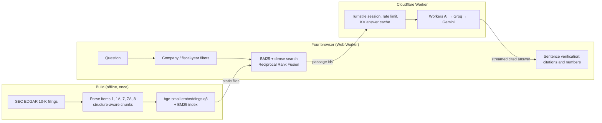

# FilingLens

Citation-verified Q&A over SEC 10-K filings. Ask about the annual reports of 12 public companies: every answer sentence cites its source passage (click it to see the exact span highlighted), sentences the sources don't back up are flagged, and questions the filings can't answer are declined.

**Live demo: [filinglens.azar-majed7.workers.dev](https://filinglens.azar-majed7.workers.dev)**. No login. The six example questions answer instantly from precomputed files; the [Pipeline Lab](https://filinglens.azar-majed7.workers.dev/lab) and [Evals](https://filinglens.azar-majed7.workers.dev/evals) pages show how retrieval choices change measured quality.

https://github.com/user-attachments/assets/6d8726cc-ed18-4cca-a2b3-6e9ae2677c45

**Demo video (81 s)**: embedded above, or [watch it on YouTube](https://youtu.be/P4qqevx9zMk). It's a Playwright-scripted recording of the live site; the live answer and the AI-judge check in it are real calls.

## Results (held-out test split)

The eval set was split 60/40 before any tuning; every choice below was made on the dev split, and the test split ran once, for these release numbers (`evals/reports/2026-09-24-test.json`, shown live on [/evals](https://filinglens.azar-majed7.workers.dev/evals)).

| Metric | Value | n |
| --- | ---: | ---: |
| Retrieval recall@10 (gold evidence in the top 10 passages) | 85.5% | 74 items with evidence |
| Answer accuracy (numeric match, judge, or correct abstention) | 82.9% | 35 items |
| Citation coverage (sentences with a valid citation) | 89.7% | 39 sentences |
| Verified sentences | 84.6% | 39 sentences |
| Abstention F1 on unanswerable questions (precision 71.4%: 2 of 7 abstentions were answerable; recall 100%) | 83.3% | 5 items |
| AI-judge agreement with reference labels: support / correctness | 95.5% (κ 0.86) / 100% (κ 1.00) | 67 / 54 labels |
| p50 latency: retrieval / answer generation | 33 ms / 1.6 s | per query |

Answers are a stratified sample of 35 test items (5 per category), because Groq's free tier allows about 75 answers a day. Retrieval latency is measured in Node on the browser's WASM runtime, including query embedding; generation latency is to the full answer on Groq.

## How it works



The browser does retrieval and verification; the Worker only sees the question and passage ids, loads the passage text from its own copy of the index, and streams an answer whose every sentence must cite a passage or decline. The same `packages/core` code runs in the browser, the Worker, and the evals.

> **Runs for $0.** Cloudflare Workers, KV, Turnstile, and the Workers AI free allocation host and answer; Groq and Google Gemini free tiers are fallbacks; search runs in the visitor's browser, so there is no vector database; models and the ONNX runtime come from Hugging Face and jsDelivr; CI, evals, and the daily smoke test run on GitHub Actions for a public repo. None of these needed a payment method. When every free quota is spent, the app says so and the example answers keep working.

## Design decisions and tradeoffs

### Retrieval config, chosen on dev, confirmed on test

The app uses `evals/configs/default.json`: structure-aware chunks, BM25 and dense search fused with Reciprocal Rank Fusion (k = 60), company and fiscal-year filters taken from the question, and no reranker. It had the best score on every quality metric on the dev split (111 items with gold evidence), and again on the held-out test split (74). Reproduce with `pnpm eval:retrieval --config all --split dev`.

| Config (`evals/configs/`) | Dev recall@10 | Dev MRR@10 | Test recall@10 | Test MRR@10 | p50 ms |
| --- | ---: | ---: | ---: | ---: | ---: |
| **default**: hybrid + filters | **88.7** | **61.7** | **85.5** | **60.9** | 33 |
| lexical-only (BM25) | 79.7 | 52.0 | 73.3 | 46.7 | 1 |
| dense-only | 75.2 | 50.1 | 79.7 | 43.8 | 29 |
| no-filters | 72.1 | 44.8 | 72.6 | 47.5 | 46 |
| fixed: 350-token windows instead of structure chunks | 64.9 | 45.1 | 69.9 | 47.3 | 29 |
| rerank: default + cross-encoder on the top 30 | 86.0 | 52.8 | 80.1 | 51.8 | 7,046 |

Latency is from the test run. Recall@5, nDCG@10, and per-category numbers are in the reports and on the Evals page.

- **Hybrid over either retriever alone:** fusion adds 9 points of dev recall@10 over BM25-only and 14 over dense-only (12 and 6 on test). Dense-only is weakest on false-premise questions (dev 36 vs 71), where exact figures and names matter.
- **Filters:** without them dev recall@10 falls 17 points (13 on test), and 24 on two-company comparisons, where the question names both companies.
- **Structure-aware chunks:** fixed windows lose 24 points of dev recall@10 (16 on test).
- **No reranker:** see What didn't work.

### Answers, verification, gateway

- **Verification is deterministic and runs in the browser:** a sentence is **verified** when it cites a passage and every number in it appears in a cited passage, or is one arithmetic step (difference, sum, ratio, percent change) from two numbers in the same answer that do. Anything else is **unverified**. An optional AI judge ("Check with AI judge") can also mark a sentence **unsupported**. A cheap check that runs on every answer, plus an opt-in judge, keeps each answer free.
- **Answers go through a Worker gateway with a provider chain:** Workers AI, then Groq, then Gemini. A provider that returns 429 or 5xx, or sends no first token within 8 s, is skipped for 60 s. The Worker loads passage text from its own static index and never trusts text sent by the browser. Answers are cached in Workers KV for 7 days, keyed by prompt version, config, normalized question, and passage ids. `/api/answer` needs a 30-minute session cookie issued after a Turnstile check, and is rate-limited per IP.
- **Precomputed examples:** the six example chips are dev items the answers eval scored correct, rendered from `web/public/examples/*.json` by `pnpm examples` through the same pipeline, so the first click needs no model, index, or API.
- **Security:** a Content-Security-Policy (`web/public/_headers`) limits scripts to the site, jsDelivr, Turnstile, and `blob:` URLs (onnxruntime-web imports its runtime from one, which the first live check caught), and connections to the site, Hugging Face, and jsDelivr. Model output renders as Markdown without raw HTML, with links only to sec.gov. No secret ships to the browser; CI greps the bundle for key patterns.

### Engineering

- **q8 embeddings everywhere:** Node and the browser run the same quantized ONNX file (34 MB instead of 133 MB), so indexed and query vectors come from the same weights.
- **Custom BM25 instead of MiniSearch:** the lexical index is a compact term → postings map with deterministic output and no dependency, and one tokenizer (`packages/core/src/lexical.ts`) runs at build time and query time.
- **Performance budget:** 81 KB of gzipped JS before first paint, 158 KB more for the search worker, which loads after it (budget: 250 KB total, excluding models and the index). Lighthouse on the live `/` (mobile preset): performance 99, accessibility 100, best practices 100; largest contentful paint 1.7 s.
- **Biome instead of ESLint + Prettier:** one dependency and one config for linting and formatting, set to Prettier's default output style.
- **Vite dev proxy instead of the Cloudflare Vite plugin:** `pnpm dev` runs `vite` and `wrangler dev` side by side, keeping a single deploy path (`wrangler deploy` in `worker/` serving `web/dist`).

## What didn't work

- **A cross-encoder reranker.** `ms-marco-MiniLM-L-6-v2`, trained on web search passages, lowered MRR@10 by 9 points on both splits and recall@10 by 3 (dev) and 5 (test), helped on only one category per split (lookup on dev, table numbers on test), and took about 7 s per query in WASM. It stays in the Lab as a comparison and is never loaded on the Ask page.
- **onnxruntime-node for query embeddings.** Its x86 int8 kernels give slightly different vectors than the browser's WASM runtime (cosine ~0.998 on some inputs), enough to reorder close results. Evals and the parity test now embed queries with onnxruntime-web, so Node and the browser return identical rankings; passages are still embedded once with the ~10x faster onnxruntime-node.
- **Workers AI's `response` stream field.** It turns numeric tokens into JSON numbers (`" 2025"` becomes `2025`, `"0"` becomes `0`), silently dropping spaces and zeros from figures. Tokens are read from `choices[].delta.content` instead.
- **GitHub Models for the judge.** On 2026-09-24 every catalog and inference request returned a bare `200 OK`, so the judge moved to Groq (`qwen/qwen3.8-27b`, a different model family from the generator).
- **Shipping onnxruntime's bundled WASM.** The fallback copy is ~27 MB, over the 25 MiB Workers static-asset limit; the build drops it and Transformers.js loads the runtime from jsDelivr.
- **The verifier's blind spot.** It checks that numbers come from the cited passages, not that they answer the question. On dev, an answer about Meta's cash quoted cash plus marketable securities (which rose) instead of cash and cash equivalents (which fell), so a false premise went uncorrected while every sentence verified. The AI judge and the correctness eval catch this kind of miss; the badge alone does not.
- **The test split was harder than dev.** Answer accuracy fell from 91.4% (dev, 35 items) to 82.9% (test, 35 items), and numeric match from 89.5% to 75.0%. Of the six misses (each has a note on the [Evals page](https://filinglens.azar-majed7.workers.dev/evals)), three read the wrong row or column of a financial table (a total that included restricted cash, the "Cash" row instead of the column total, a segment's operating margin instead of the company's); two declined answerable two-company questions, once because retrieval surfaced only one company's figure and once although both figures were retrieved; and one answered a nearby question when retrieval missed the evidence. Flattened tables are the main weakness, and the next place to invest.

## Eval methodology

### Eval set v1

211 questions over the 24 filings (`evals/datasets/golden.jsonl`), split 60/40 into dev (127) and test (84) within each category. Evidence is stored as character offsets into each filing's text, so labels don't depend on chunking; a retrieved chunk counts as relevant if it overlaps a gold span by at least 30 characters. `evals/datasets/text_hashes.json` pins each text, and the runner refuses to score if one changed.

| Category | Items | Sources |
| --- | ---: | --- |
| lookup | 34 | synthetic, reviewed |
| table_number | 36 | XBRL |
| comparison | 28 | XBRL 24, synthetic 4 |
| trend | 24 | XBRL |
| multi_hop | 40 | XBRL 24, handwritten 10, synthetic 6 |
| false_premise | 23 | handwritten 17, synthetic 6 |
| unanswerable | 26 | handwritten 11, synthetic 15 |

- **XBRL items** (`pnpm data:xbrl`) take exact values from SEC's structured data: single values, year-over-year changes, ratios, and two-company comparisons, always the figure for the filing's own fiscal-year end.
- **Synthetic items** were proposed by `openai/gpt-oss-120b` on Groq from sampled passages. Quotes that weren't verbatim were dropped automatically, which left 94 proposals.
- **Review:** at the project owner's request, Claude (the AI coding assistant that built this repo) did the review and labeling a person would normally do: it kept 65 synthetic proposals (8 edited) and rejected 29, with a reason for each in `evals/review/queue.csv`; wrote the 38 handwritten items (`evals/review/handwritten.csv`), checking every answer against the filing text; wrote the judge-calibration labels; and wrote the failure notes on the Evals page.

### Metrics

- **Retrieval** (no LLM): recall@5 and @10 (share of gold evidence groups found), MRR@10, nDCG@10, per config and category.
- **Answers:** `pnpm eval:answers` runs the production path end to end: the browser's retrieval code, the Worker's prompt, `openai/gpt-oss-120b` on Groq (the live chain's second provider; Workers AI's Llama 3.3 answers first), sentence verification, and the judge.
  - **Numeric match** accepts the gold number stated in the answer, rounded within the item's tolerance. For "How did X change?" items, whose gold number is a percent change, stating both endpoints also counts.
  - **Judge correctness** (non-numeric answers), **false-premise correction**, **abstention** precision and recall on unanswerable items.
  - **Citation coverage** (sentences with a valid citation), **citation precision** (the cited passage holds gold evidence or the judge says it supports the sentence), **verified-sentence rate**.
- **Judge calibration** (`pnpm eval:judge`, `evals/datasets/judge_labels.jsonl`): agreement and Cohen's kappa against 121 labels covering real answers plus hand-edited wrong variants (a prior year's figure, swapped companies, an accepted false premise, a citation to the wrong company's table), since the real answers are mostly right. The support judge's misses were unsupported sentences it accepted, for example "more than tripled" for a 1.7x rise.
- **Reproducibility:** every LLM call is cached in `evals/.cache/` by sha256(model | prompt), so reruns are free and identical; runs stopped by the free-tier quota resume from the cache.
- **CI gates** (`.github/workflows/ci.yml`): every push runs the retrieval eval on dev and fails if recall@10 drops more than 2 points below `evals/baseline.json`; with a Groq key it also runs 20 answer items gated on numeric match and citation coverage. `eval.yml` runs a full dev or test eval on demand and can commit the release report. `smoke.yml` checks the live site daily (health endpoint, home page, one example, no CSP violations) and opens an issue on failure.

## Run locally

Needs Node 22+, pnpm 10, and [uv](https://docs.astral.sh/uv/) (Python 3.12).

```sh
pnpm i
uv sync --project pipeline
export SEC_USER_AGENT="Full Name email@example.com"   # SEC's fair-access rule
pnpm data:ingest && pnpm data:chunk && pnpm data:xbrl   # download and parse the 24 filings
pnpm index                                             # web/public/index/ (embeddings, BM25)
pnpm dev                                               # Vite + wrangler dev, /api proxied
```

Live answers need `worker/.dev.vars` (copy `worker/dev.vars.example`) with free Groq and Gemini keys and Cloudflare's always-pass Turnstile test secret. Without them the examples, retrieval, the Lab, and the Evals page still work.

Checks and evals:

```sh
pnpm -s lint && pnpm -s typecheck && pnpm -s test && pnpm -s e2e
uv run --project pipeline ruff check -q && uv run --project pipeline pytest -q
pnpm eval:retrieval --config all --split dev          # no LLM calls
GROQ_API_KEY=... pnpm eval:answers --split dev --limit 35
```

## Data sources and terms

| Source | Used for | Terms |
| --- | --- | --- |
| [SEC EDGAR](https://www.sec.gov/edgar): `company_tickers.json`, the submissions API, and 10-K primary documents | The filings corpus (`pipeline/config/corpus.yaml`) | U.S. government public data. Downloads follow the [fair-access policy](https://www.sec.gov/os/accessing-edgar-data): a declared User-Agent, at most 5 requests per second (the cap is 10), and a local cache so each file is fetched only once. |
| [`Xenova/bge-small-en-v1.5`](https://huggingface.co/Xenova/bge-small-en-v1.5) `tokenizer.json`, pinned revision `ea104dac` | Chunk token counts; passage and query embeddings (`onnx/model_quantized.onnx`, q8), in Node at index time and in your browser at query time | ONNX conversion of [`BAAI/bge-small-en-v1.5`](https://huggingface.co/BAAI/bge-small-en-v1.5) (MIT). The browser downloads it from huggingface.co. |
| [onnxruntime-web](https://www.npmjs.com/package/onnxruntime-web) WASM via [jsDelivr](https://www.jsdelivr.com/terms) | Running the embedding model in the browser | MIT; Transformers.js loads it from cdn.jsdelivr.net. |
| SEC EDGAR [XBRL company facts API](https://www.sec.gov/search-filings/edgar-application-programming-interfaces) | Numeric eval items with exact answers (`pnpm data:xbrl` → `evals/datasets/xbrl_numeric.jsonl`) | Same as EDGAR above. |
| [`Xenova/ms-marco-MiniLM-L-6-v2`](https://huggingface.co/Xenova/ms-marco-MiniLM-L-6-v2), pinned revision `a0914435` | The rerank config in evals and the Pipeline Lab (not used on the Ask page) | ONNX conversion of [`cross-encoder/ms-marco-MiniLM-L-6-v2`](https://huggingface.co/cross-encoder/ms-marco-MiniLM-L-6-v2) (Apache-2.0). |
| [Groq](https://groq.com/terms-of-use) free tier, `openai/gpt-oss-120b` | Proposing synthetic eval questions (`pnpm eval:synth`), which were reviewed before entering the eval set; second fallback for live answers; the generator in answer evals and precomputed examples | Model weights Apache-2.0. Free tier, no card needed. |
| [Groq](https://groq.com/terms-of-use) free tier, `qwen/qwen3.8-27b` | The AI judge: "Check with AI judge" in the app (`/api/verify`) and the judged metrics in answer evals | Free tier, no card needed. |
| [Cloudflare Workers AI](https://www.cloudflare.com/service-specific-terms-developer-platform/) free allocation, `@cf/meta/llama-3.3-70b-instruct-fp8-fast` | First choice for live answers (`worker/src/providers/`) | [Llama 3.3 Community License](https://www.llama.com/llama3_3/license/). 10k free neurons a day, roughly 70 answers. |
| [Google Gemini API](https://ai.google.dev/gemini-api/terms) free tier, `gemini-3.5-flash-lite` | Last fallback for live answers | Free tier, no card needed. Google may use free-tier prompts to improve its products; prompts contain only public filing text and the visitor's question. |
| [Cloudflare Turnstile](https://www.cloudflare.com/turnstile-terms-of-use/) | Bot check before a visitor can request live answers | Free; no personal data is stored by FilingLens. |

Raw filings and processed text live in `data/` and are not committed.

### Limitations

- **Small corpus:** 12 companies (NVIDIA, AMD, Intel, Apple, Microsoft, Alphabet, Amazon, Meta, Netflix, Coca-Cola, PepsiCo, JPMorgan Chase), two fiscal years each, and only Items 1, 1A, 7, 7A, and 8 (business, risk factors, MD&A, market risk, financial statements). Questions about other sections or companies are declined.
- **The measured generator isn't always the live one:** evals and examples use `openai/gpt-oss-120b` on Groq, while live answers start with Llama 3.3 on Workers AI and fall back to Groq, then Gemini. The provider and model are shown under each live answer.
- **Sample sizes:** answer metrics cover 35 of 84 test items because of Groq's daily free quota; with n = 35, one item moves accuracy by about 3 points.
- **Verified is not the same as correct:** the badge checks citations and numbers against the cited text, not whether the sentence answers the question (see What didn't work).
- **Free quotas:** Workers AI allows roughly 70 answers a day; when every provider's quota is spent, live answers pause until the next day and the examples keep working. Live answers are rate-limited to 6 a minute per IP.
- **Not financial advice.** Answers can be wrong; check the cited passage and the filing on SEC.gov.

## License

[MIT](LICENSE)
